# kottans-frontend
The Udacity "Version Control with Git course" is magnificent. So satisfied with the way of explanation and materials presentation! Learngitbranching.js.org visualization of Git's most recently used operations, especially branching, provided a much easier perception of such complicated topics. Applaud! Quite excited to see further tutorials:)

---

## Linux CLI, and HTTP

### Linux survival screenshots:

 
	
 Module 1

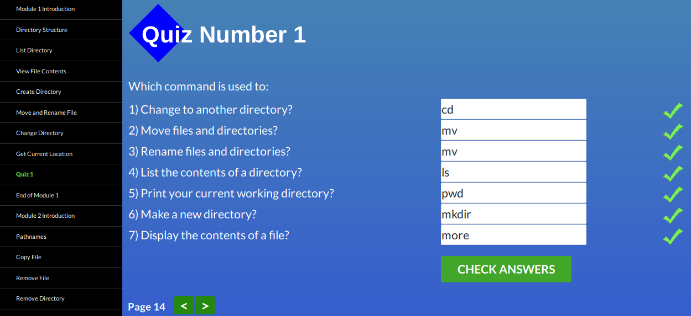

 
	
 Module 2

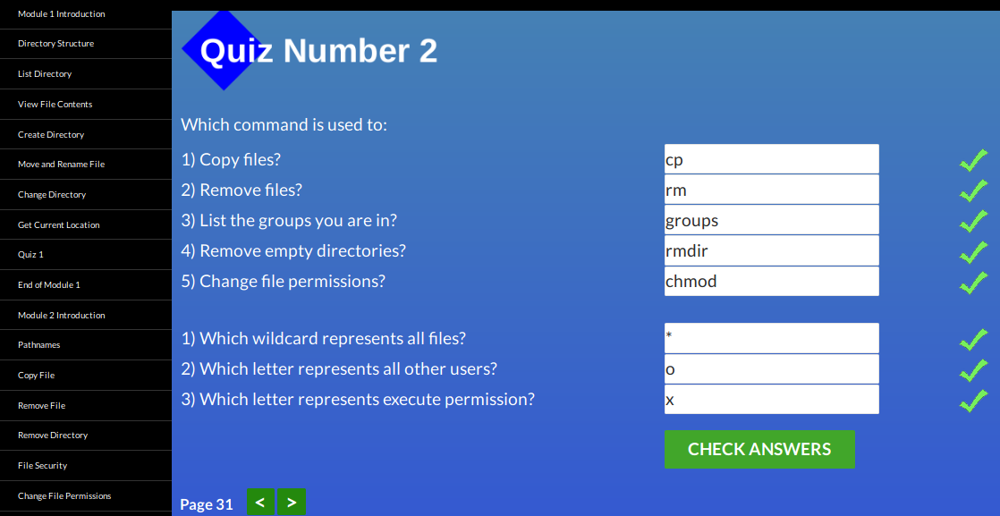

 
	
 Module 3

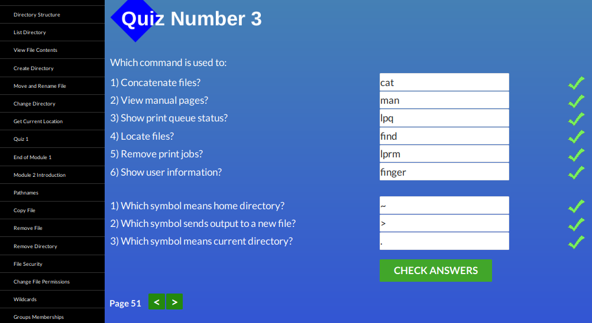

 
	
 Module 4

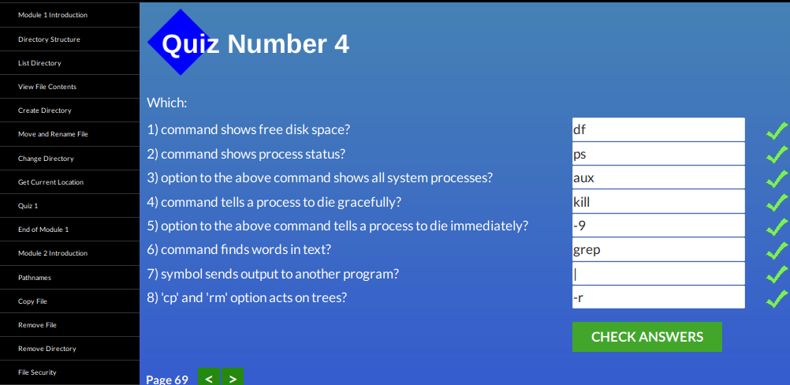
	

### What was new? :books:

* Linux commands, especially which dedicated to printing;
* HTTP methods such as TRACE, HEAD;
* HTTP headers and their usage ;
* Details about the way of how does the caching mechanism work and its validation.

### What did surprise me? :open_mouth:

* Websites typically use Basic Authentication.

### Intentions for further usage :information_desk_person: :

* Methods and status codes for developing reliable RESTful API;
* Authentication and its mechanisms (MD5, SHA) in conjunction with SSL and TLS;
* Caching for improving the experience on the web by the usage of caching headers, which 
also provide optimization of bandwidth usage and save time expenditures.

---

## Git Collaboration

### Task 3 screenshots can be found below:

 
	
GitHub & Collaboration

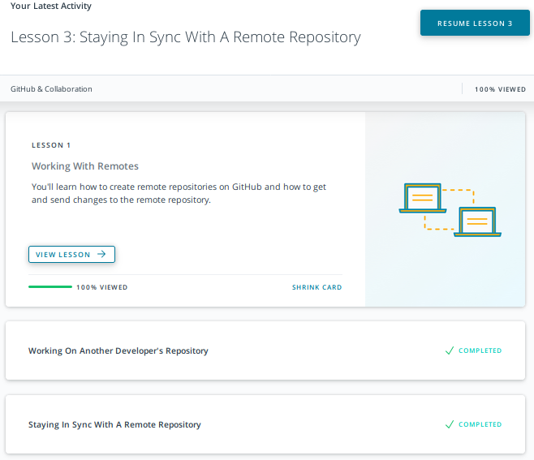

 
	
Learngitbranching Remote

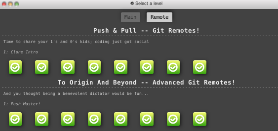

 
	
Learngitbranching Main

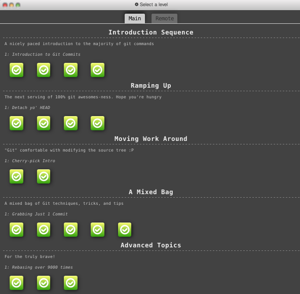

### What was new?  :green_book:

* How the collaboration with other developers happens;
* The difference between the forked repo and the source one and its syncing;
* The king of commits management aka `rebase`;
* Tools for the rapid finding of the necessary information in commits history _(previously used git log and piped it to grep)_.

### What did surprise me?  :smiley_cat:

* The power of `git rebase` and its user-friendliness provided by the interactive mode.

### Intentions for further usage :raising_hand: :

Seems like I've become invincible after that task! Just kidding:)
More practice is vitally necessary.

* Work with code published in remote repo's;
* Develop on shared repo's;
* Collaborate with people around the globe;
* Keep commits history well-tended.

---

## Intro to HTML and CSS

### Task 4 screenshots can be found below:

 
	
Intro to HTML & CSS

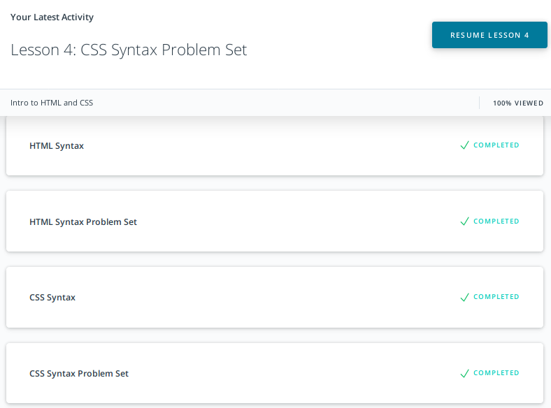

 
	
Learn HTML

 
	
Learn CSS

### What was new?   :orange_book:

* Several semantic tags and purposes of their usage;
* Typography details such as the addition of `word-spacing` property value to the default spacing;
* Certain information about particularities of grid layouts implementation.

### What did surprise me? :ok_woman:

* Making of layouts with grids and flex boxes can be so comfy and even [that much](https://media.giphy.com/media/d1MoLyoyipfMc/giphy.gif) flexible. Now I'm 1000% sure that they earned their title!

### Intentions for further usage  :computer: :

*  Application of tags attributes alongside semantic tags in the markup for gaining higher search engine ranking and as assistance for people with disabilities;
* Creation of responsive web pages' layouts with such PRO techniques as CSS Grid and Flexbox.
* Implementation of CSS animation as a lightweight solution for developing interactive pages.

---

## Responsive Web Design

### Task 5 screenshots can be found below:

 
	
Responsive Web Design Fundamentals

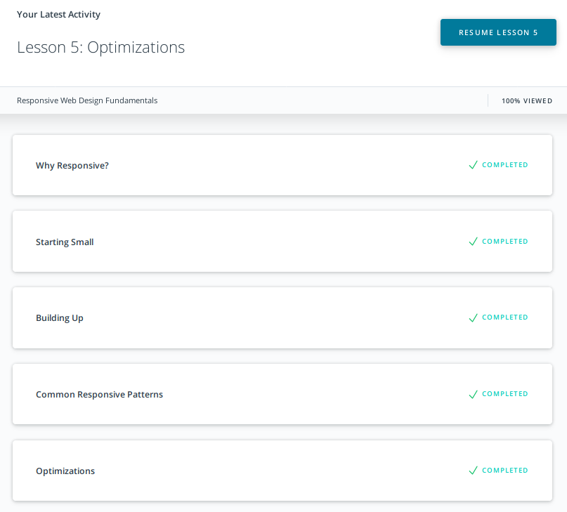

 
	
Flexbox Froggy

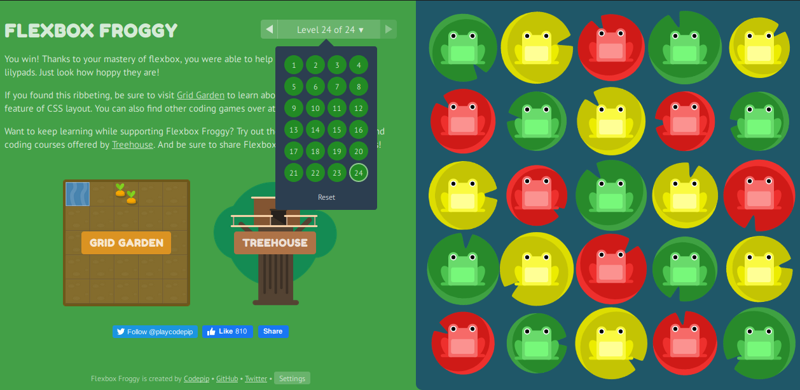

### What was new? :closed_book:

* Tips for making responsive data tables;
* RWD patterns: _Column Drop, Layout Shifter, Mostly Fluid, Off Canvas_;
* Average width of the index finger is in the range 16 - 20 mm for most adults, therefore buttons and all "clickable" targets have to be not less than 45 pixels (or have enough space around them) for being finger-friendly;
* Peculiarities of working with viewport and perception of DIP.

### What did surprise me?  :hushed:

* Actually, it's not quite obvious that making the website layout in reverse order (from mobile to desktop) can save you a lot of time and nerves. [Thank u](task_responsive_web_design/helpful.gif) for recommending that course! 

### Intentions for further usage :bulb: :

* Creation of responsive websites for any kind of device with both major and minor breakpoints to fit the need of even the most exacting users and give it a perfect look.

The Responsive Web Design Fundamentals course referred to [that course](https://www.udacity.com/course/responsive-images--ud882) on one of its stages, which provides extremely valuable information on the optimization of images.

---

## JS Basics

### Task 7 screenshots can be found below:

 
	
Intro to JS

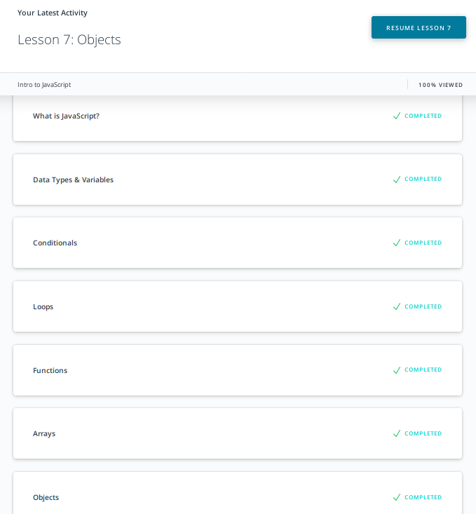

 
	
Basic JavaScript

 
	
ES6 Challenges 

 
	
Basic Data Structures

 
	
Basic Algorithm Scripting

 
	
Functional Programming 

 
	
Algorithm Scripting Challenges

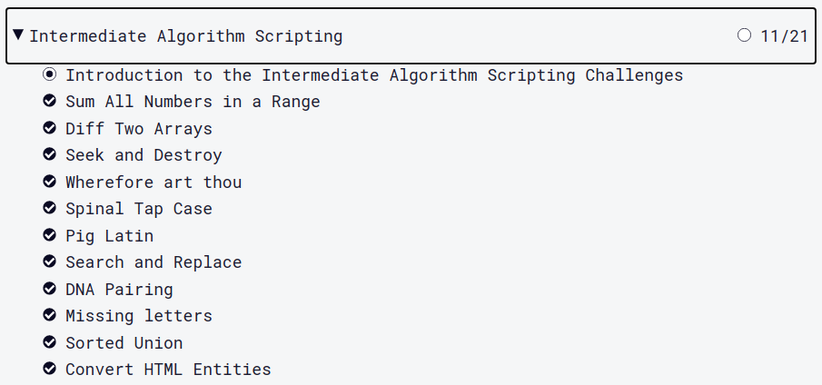

### What was new? :blue_book:

ES6 brought happiness to my life by providing such features as:

* `const` and `let` as an appropriate way of defining variables with limited scope peculiarities that make code much stable;
* Arrow functions with their concise syntaxis allowing to omit near a half of function's syntaxis constructions in its declaration;
* Template literal strings in conjunction with interpolation (totally in love with it);
* Built-in module system capable of easily `import` and `export` any necessary code;  
* Incredibly powerful and flexible spread operator `...` 

### What did surprise me?   :clap:

* [To what extent ES6 and functional programming(FP) facilitate developers' lives](https://media.giphy.com/media/NnGGHE0muVqpO/giphy.gif) by offering the great opportunities mentioned above.

### Intentions for further usage  :running: :

*  Development of easily maintainable, stable code with high performance by using the ES6 standard and FP approaches. 

---

## DOM

### Task 8 screenshots can be found below:

 
	
JavaScript and the DOM

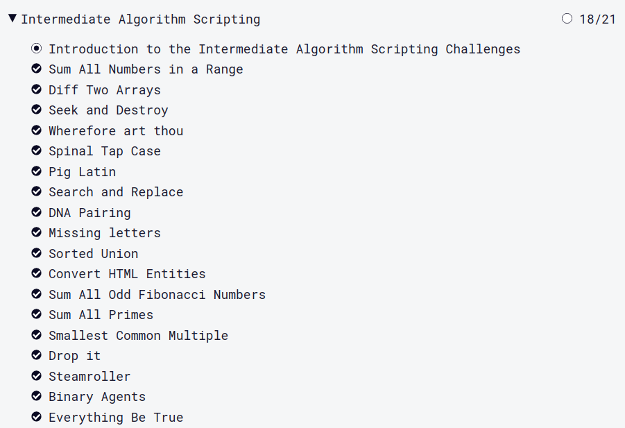

 
	
Algorithm Scripting Challenges

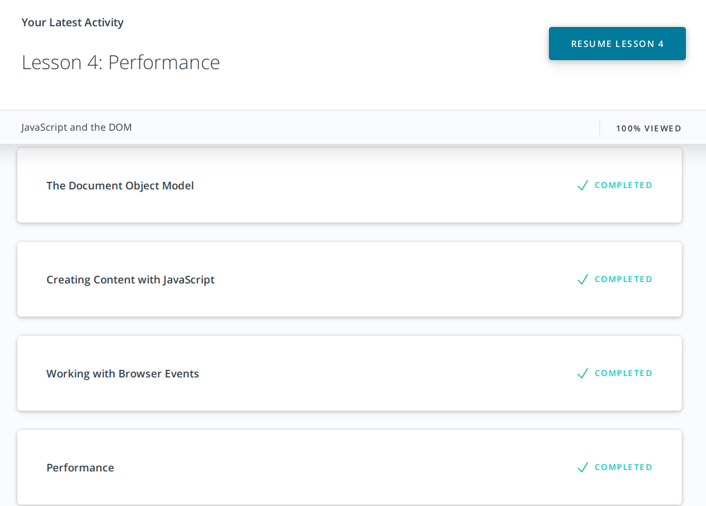

JavaScript DOM task demo can be found [here](https://kt-std.github.io/js-dom/).

### What was new?  :ledger:

* Methods of DOM manipulation, DOM's structure, and how it can be accessed; 
* Ways of creating content and adding it to the DOM;
* Peculiarities of page rendering with reflow and repaint and ways of its optimization while adding new content;
* Phases of events, how it influences of listeners invocation;
* Events delegation model for the avoidance of redundant events listeners creation.

### What did surprise me? :flushed:

* The concurrency model presented by event loops and the whole scheme defining how events performed.   

### Intentions for further usage :eyes:

*  Unlimited abilities! Let's start from the usage of JavaScript for creating pages with dynamic data and manipulating its content.